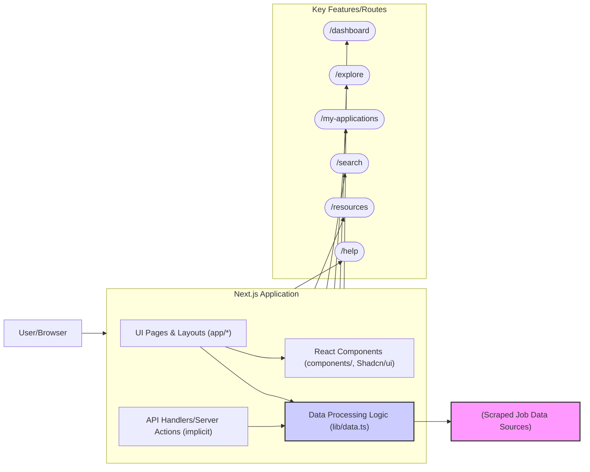

# Job Dashboard Application

A Next.js application designed to display and manage job-related data.

## Table of Contents

- [Project Overview](#project-overview)
- [Features](#features)
- [Tech Stack](#tech-stack)
- [Architecture](#architecture)
- [Prerequisites](#prerequisites)
- [Getting Started](#getting-started)
- [Available Scripts](#available-scripts)
- [Deployment](#deployment)
- [Contributing](#contributing)
- [License](#license)

## Project Overview

This Job Dashboard application is designed to help users track, analyze, and gain insights from job market data. It aggregates job postings scraped from various sources, providing a centralized platform to view listings, explore company information, manage personal job applications, and identify market trends through an analytics dashboard.

The project is built with Next.js, leveraging server components and a modern frontend stack to deliver a responsive and informative user experience.

## Features

-   **Comprehensive Dashboard:** View a primary dashboard with current job listings, company overviews, and key statistics.
-   **Job Market Analytics:** Access detailed analytics including:
    -   Total job counts and breakdowns (remote, hybrid, on-site).
    -   Top hiring companies and locations.
    -   Job posting trends over time.
    -   Distribution of in-demand skills extracted from job descriptions.
    -   Most common job titles.
-   **Explore Companies:** Browse and learn more about companies featured in the job dataset.
-   **My Applications:** A dedicated section to save and manage job applications.
-   **External Job Search:** Functionality to search for jobs on external portals.
-   **Data Utilities:** Includes robust data processing for:
    -   Formatting dates for readability.
    -   Extracting work types (Remote, Hybrid, On-site).
    -   Parsing salary information.
    -   Identifying key skills from descriptions.
-   **Resource Section:** (Placeholder for potential help articles, tools for job seekers - inferred from `app/resources` and `app/help`)

## Tech Stack

-   **Framework:** Next.js (App Router)
-   **Language:** TypeScript
-   **Frontend:** React
-   **Styling:** Tailwind CSS
-   **UI Components:** Shadcn/ui, Radix UI (inferred from dependencies and `components/` structure)
-   **Data Processing:** Custom utility functions in `lib/data.ts`
-   **Package Manager:** npm (primary, based on `package-lock.json`)

## Architecture

Below is a high-level overview of the application architecture:



This diagram illustrates:
- The user interacts with the Next.js application through their browser.
- The Next.js app uses the App Router paradigm, with pages and layouts defined in the `app/` directory.
- UI is built with React components, including those from Shadcn/ui and custom components.
- Core data processing, statistics generation, and utility functions are handled by scripts in `lib/data.ts`.
- The application consumes job data scraped from various external sources.
- Key features are accessible via dedicated routes like `/dashboard`, `/explore`, `/my-applications`, etc.

## Prerequisites

Before you begin, ensure you have met the following requirements:
-   Node.js (LTS version recommended, e.g., v18.x or v20.x)
-   npm (comes with Node.js)

## Getting Started

To get a local copy up and running, follow these simple steps:

1.  **Clone the repository:**
    ```bash
    https://github.com/satyakrishna555/job-dashboard
    ```

2.  **Install dependencies:**
    ```bash
    npm install
    ```
    (If you prefer `pnpm`, ensure `pnpm-lock.yaml` is up-to-date and use `pnpm install`.)

## Available Scripts

In the project directory, you can run the following scripts (using npm):

-   `npm run dev`: Runs the app in development mode. Open [http://localhost:3000](http://localhost:3000) to view it in the browser.
-   `npm run build`: Builds the app for production to the `.next` folder.
-   `npm run start`: Starts the production server after a build.
-   `npm run lint`: Lints the project files using Next.js's built-in ESLint configuration.

## Deployment

This application is deployed on Vercel and can be accessed here:
[https://job-dashboard-kappa.vercel.app/](https://job-dashboard-kappa.vercel.app/)

## Contributing

Contributions are welcome! If you have a suggestion that would make this better, please fork the repo and create a pull request. You can also simply open an issue with the tag "enhancement".

1.  Fork the Project
2.  Create your Feature Branch (`git checkout -b feature/AmazingFeature`)
3.  Commit your Changes (`git commit -m 'Add some AmazingFeature'`)
4.  Push to the Branch (`git push origin feature/AmazingFeature`)
5.  Open a Pull Request

## License

This project is licensed under the MIT License - see the [LICENSE](LICENSE) file for details.
